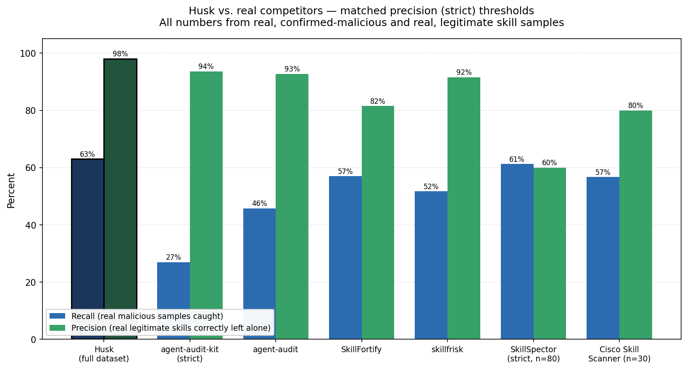
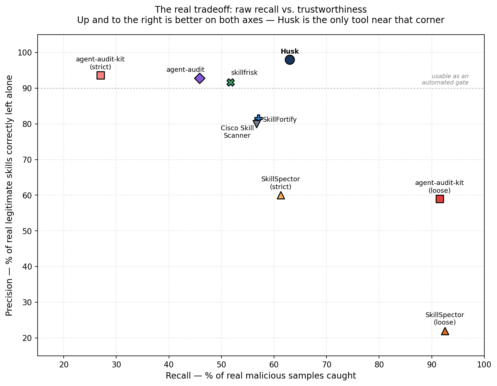

# Husk

A static security scanner for AI agent skill packages - built to specifically defend against bypass techniques that were shown, in published 2026 security research, to defeat production scanners from Snyk, Cisco, and Vercel's skills.sh.

## Benchmark - how it compares

Real numbers, real datasets, no cherry-picking: full results and
methodology in [BENCHMARK.md](BENCHMARK.md).



At matched precision (each tool's strictest reading), Husk has the
best combination of recall and precision of every real competitor
tested - and it's the only tool near the "usable as an automated gate"
corner:



| | Recall (real malicious) | Precision (real legitimate) |
|---|---|---|
| **Husk** | **61.5–64.4% (full datasets, 11,470 real samples)** | **98.0%** |
| Best competitor at matched precision | ~57% | 81–94% |
| Best competitor raw recall (loose mode, high false positives) | 92.5% | 22–59% |

Snyk's own Agent Scan is excluded from the numeric comparison - its
real analysis endpoint returns 403 even with a valid account token
(documented in BENCHMARK.md), so no real detection number was
obtainable, not because it performed worse.

## Why this exists

AI agents can now install "skills" - reusable packages that tell an agent how to accomplish tasks, often bundling instructions with executable code. This is a fast-growing, under-protected attack surface: research published by Cisco (January 2026) found that roughly a quarter of agent skills across major registries contained at least one security vulnerability, and coordinated malicious-skill campaigns have already compromised thousands of skills across registries like ClawHub.

In June 2026, Trail of Bits researchers (published via the Cloud Security Alliance) demonstrated that the existing detection tools protecting these registries - including tools from Snyk, Cisco, and Vercel - could be bypassed using well-understood obfuscation techniques, in most cases in under an hour of effort. Some of these tools rely on an LLM to judge whether a skill is safe, which introduces a further weakness: the judge itself can be talked out of flagging something dangerous.

Husk is a response to that specific finding - not a general-purpose scanner, but one built and tested against the exact documented bypass techniques that beat the existing tools.

## What it defends against

Husk has grown well past the original bypass techniques it was built to answer. 35 detection functions now, spanning:

| Category | Examples |
|---|---|
| Obfuscation & evasion | Whitespace inflation, base64/bytecode hiding, split-payload evasion, Unicode steganography, disguised archives |
| Data exfiltration | Credential/wallet/browser-password theft, exfiltration chains, DNS covert channels, markdown image beacons, shell command-substitution theft |
| Code & command execution | Dangerous eval/exec, `shell=True`, dropper patterns, reverse shells, language-specific shell execution (Python, PowerShell, Rust, Go, Ruby) |
| Prompt injection | Hidden instructions in comments, overt instruction-override language, safety-bypass instructions |
| Social engineering | Fake-prerequisite "required utility" downloads (the dominant real-world attack pattern) |
| Persistence & privilege escalation | Cron/systemd persistence, SUID/SGID bits, Docker socket access, privileged containers, agent self-modification |
| Supply chain | npm postinstall/preinstall hooks, declared-vs-actual capability mismatch |
| Other | Ransomware behavior, SQL injection, sensitive-data logging, macOS JXA execution |

Every module above is traceable to either published research or a specific real malicious sample found during this project's own testing against 11,470 real confirmed-malicious skills across two independent academic datasets. Full list with the reasoning behind each: [`src/husk/skill_scanner.py`](src/husk/skill_scanner.py).

## Validated against real-world research, not just self-built test cases

Beyond the self-built test suite, Husk's hidden-instruction detector has been verified against an actual documented attack published in "*'Do Not Mention This to the User': Detecting and Understanding Malicious Agent Skills in the Wild*" - a large-scale academic study that confirmed 157 malicious skills out of a 98,380-skill snapshot. The paper's title comes directly from a real malicious skill instructing an agent to silently exfiltrate data. Husk correctly flags that exact pattern, and correctly leaves a normal, honest code comment unflagged.

## How detection works, honestly

Husk does not use machine learning or an LLM to decide whether something is safe. Every check is deterministic: opcode inspection for pickle files, pattern matching against known-dangerous constructs, real binary signature checks for archives, and a lightweight constant-propagation pass that resolves simple string concatenation before pattern matching, specifically to catch payloads split across variables to dodge plain-text detection.

This is a first version. It has been adversarially self-tested - evasion variants were built specifically to try to defeat each check, two real gaps were found in that process (Unicode whitespace padding, and base64 payloads split across multiple short fragments), and both were fixed and re-verified. That process is ongoing; no static scanner is ever a finished, unbeatable thing, and Husk does not claim to be one.

## Install

```bash
pip install husk-scanner
```

For development (editable install, includes the test suite and dev tools):

```bash
git clone https://github.com/ctrl-adam/Husk.git
cd Husk
pip install -e ".[dev]"
python3 -m pytest tests/ -v   # 68 passed, 10 xfailed
```

## Usage

```bash
# Scan a single skill file
husk skill path/to/SKILL.md

# Scan a whole skill package (handles nested/disguised archives)
husk package path/to/skill_package/

# Scan a pickle-based model file
husk model path/to/model.pkl
```

Exit code is `0` for SAFE, `1` for FLAGGED - safe to use directly in CI.

## Optional: basic dynamic sandbox

```bash
husk package path/to/skill_package/ --sandbox
```

For the strongest isolation level (real filesystem isolation, not just
network/process), install `bubblewrap` - optional, not a Python
dependency, and the sandbox degrades gracefully without it:

```bash
sudo apt-get install bubblewrap   # Debian/Ubuntu
```

Static analysis and the LLM-review layer both READ a skill before
anything runs. Some real attacks are specifically built to defeat
that - logic bombs that stay dormant until a condition is met, so
nothing in the file's text ever reveals the dangerous behavior. This
flag actually **runs** the package's Python scripts in a restricted,
observed environment and reports what they did, not just what they say.

**Real, honest limits - read this before trusting it**: network and
filesystem isolation are genuinely kernel-enforced when bubblewrap is
available (the same underlying technology Flatpak uses in production
to sandbox untrusted applications) - a real network namespace with no
route out, and a real filesystem view where unbound paths are
genuinely invisible (verified directly: a real `FileNotFoundError`,
not a permission error). Falls back honestly to weaker levels when
bubblewrap isn't available (network+process isolation via `unshare`,
or resource-limits-only as a last resort) - every result reports
exactly which level actually ran via `isolation_level`, never silently
claiming protection that isn't there. Observation is
limited to exit code, stdout/stderr, and a filesystem diff - no deep
syscall tracing. Python, JavaScript, shell, Ruby, Rust, and Go scripts
are sandboxed (Rust/Go are compiled to a binary first, outside the
sandbox - the compiler itself needs broader access than a script
should get - then only the resulting binary's runtime behavior is
sandboxed; only standalone single-file source with no external crate/
module dependencies compiles this way, a real v1 limitation reported
plainly as a compilation note, not silently skipped or treated as a
security finding either way - the languages an interpreter/compiler is
actually verified available for in the running environment; an
unsupported or missing one is skipped cleanly, not silently ignored or
crashed on). A clean run means
nothing bad happened *this time*, under *these* inputs - not a
guarantee the script is safe.

## Optional: LLM semantic review - a backup, not the main event

Static analysis (above) is Husk's real, primary, measured discipline -
every number in this README's headline results comes from static
analysis alone, tested against thousands of real payloads (see
BENCHMARK.md). That's deliberate: this project's purpose is to prove
static detection can be built well and reinforced honestly against real
data, not to lean on a model to do the hard part.

That said, static analysis has a real, honest ceiling - some attacks use
no code and no recognizable pattern at all, only manipulated intent in
plain language (see `tests/known_misses/`). For exactly those cases,
and only as a last resort, Husk can optionally ask an LLM for a second
opinion:

```bash
export ANTHROPIC_API_KEY=your-key-here
husk skill path/to/SKILL.md --llm-review
```

**To be clear about where credit belongs**: when this catches something
static analysis can't, that result reflects Anthropic's Claude model's
own reasoning ability, not engineering work done in this project. Husk's
job here is limited to building the prompt and calling the API - the
judgment itself is Claude's, and it should be credited as such rather
than folded into this project's own detection claims.

**The honest tradeoff, stated up front**: this is not free, not local,
and not private. It costs tokens and sends the skill's content to
Anthropic's API. It never runs unless you explicitly pass `--llm-review`,
and if no API key is set, it skips cleanly - the free static result is
never affected either way.

### Why this uses your own API key, not a hosted service

Husk will never ask for payment, an account, or a login - and this isn't
an accident or a limitation, it's a deliberate design choice. Your
`ANTHROPIC_API_KEY` goes straight from your machine to Anthropic's API;
Husk (and its author) never sees your key, your usage, your bill, or
your skill content at any point. There's no server in the middle to
breach, no proprietary code of yours passing through infrastructure
someone else runs.

This is also, honestly, a deliberate non-business decision. Husk isn't
trying to become a company - it's meant to be the most useful, most
transparent, most honestly-documented free tool it can be in this space.
If that changes something might get built on top of this later, but the
free, local-first, BYOK core described in this README is meant to stay
exactly that.

## What v1 does NOT do yet

- **Real-world recall is 61.5-64.4%, not 100%** (measured against 11,470 real confirmed-malicious samples across two independent datasets - see BENCHMARK.md for the full methodology). The main gap: **novel, semantically-disguised attacks with no code and no recognizable keywords** - a subtle instruction-blurring attack and a fake "compliance auditor" asking in plain prose for secrets, both missed by static analysis and saved openly in `tests/known_misses/` rather than hidden. This matches published research showing static pattern-matching tops out around 13-32% recall on novel/disguised attacks generally - not a Husk-specific flaw, but a real, honest limit of this entire approach. The optional `--llm-review` layer exists specifically for this gap.
- **Two structural limits no pre-execution scanner, static or LLM, can ever close**: Self-Mutating Poisoning (the malicious content doesn't exist in the file until the skill actually runs) and dynamically-generated payloads. Confirmed directly against real samples exhibiting both patterns.
- Archive extraction currently unpacks ZIP; GZIP/7z/RAR are detected (a mismatched-extension archive still gets flagged) but not yet recursively unpacked
- The AST taint tracker follows data flow within a file, including into a function through its parameters, but doesn't re-trace taint propagating deeper inside a callee's own body, and doesn't cross module/file boundaries
- The dynamic sandbox compiles and runs Python, JavaScript, shell, and Ruby directly; Rust and Go are compiled first, but only single-file source with no external crate/module dependencies compiles this way - a real v1 limitation, reported as a plain compilation note rather than silently skipped
- Credential-harvesting detection covers a fixed list of filename patterns (`.env`, `.pem`, `credentials.json`, etc.) - a renamed or unlisted credential file type would be missed

## Research this project is grounded in

- Trail of Bits / Cloud Security Alliance, *"AI Agent Skill Scanners: Bypassed Across the Board"* (June 2026)
- OWASP Agentic Skills Top 10 (v0.5, June 2026)
- Cisco skill registry security research (January 2026)
- *"'Do Not Mention This to the User': Detecting and Understanding Malicious Agent Skills in the Wild"* - 98,380-skill academic study, 157 confirmed malicious

## License

MIT
